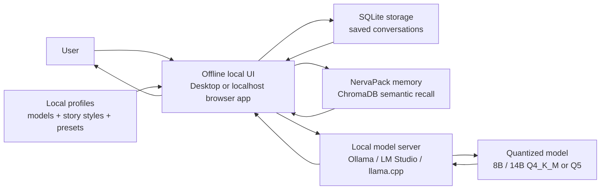

# ADR 0001: Offline Local LLM Interface

## Status

Accepted, revised after product direction clarification

## Date

2026-06-23

## Context

The application is intended to help a user interact with a local LLM for long-form writing and interactive storytelling. The target runtime is Apple Silicon hardware using local 8B/14B quantized models, especially Q4_K_M and Q5 variants, where response coherence is best when generation is constrained to a moderate reply length.

The current implementation is a Python CLI that connects to a locally running model server. It supports:

- Ollama through `http://localhost:11434/api/chat`
- OpenAI-compatible local servers through `/v1/chat/completions`
- A default 400-800 token reply target
- Recent conversation history
- Configurable sampling and model settings
- Custom system prompts from local files

The user has explicitly clarified that the application should be an offline local interface with a strong local UI or desktop app experience. That means the product must work without cloud inference, hosted APIs, telemetry, account login, or remote storage.

## Decision

Build the application as an offline-first local interface around a user-managed local model server.

The CLI remains a useful development and diagnostic tool, but the product interface is now a localhost browser UI because the desired output quality depends on better workflow support: saved conversations, profile switching, preset controls, editing, export, and readable long-form output.

The application will treat local HTTP model endpoints as local infrastructure, not as external services. The default endpoint should be loopback-only through `localhost`. LAN endpoints may be supported later as an explicit advanced setting for users running the model server on another machine.

The application will not include cloud provider integrations by default. Any future non-local provider support must be opt-in, visibly labeled, and separate from the offline mode.

## Architecture

## Key Constraints

- The application must run offline once the model and runner are already installed.
- Conversation content must remain on the user's machine.
- No telemetry, analytics, remote logging, or remote prompt storage.
- No required Python dependencies beyond the standard library for the initial CLI.
- The reply target should default to 400-800 tokens for coherence on 8B/14B quantized models.
- Users must be able to override model, endpoint, temperature, top-p, repeat penalty, context length, and output length.
- Conversations must be saved locally.
- Model profiles, story style profiles, and generation presets must be reusable local objects.

## Interface Choice

The target interface is a local UI or desktop application. A good output experience needs more than a terminal:

- A conversation list with local search and resume.
- A focused writing/chat pane optimized for long replies.
- Model and preset controls that can be changed without restarting the app.
- Style/profile switching for different story modes.
- Local export actions for finished conversations or selected scenes.
- Clear status for model connection, generation progress, and failures.

The CLI should remain available for testing, debugging, and automation. It should not be the main product experience.

The implemented first GUI is a local browser UI served from `localhost`, backed by a small local API process. A desktop wrapper can follow once the app shape is stable.

## Generation Defaults

The app will default to:

- `min_tokens`: `400`
- `max_tokens`: `800`
- `temperature`: `0.85`
- `top_p`: `0.9`
- `repeat_penalty`: `1.08`
- `context_messages`: `18`

The exact token count cannot be guaranteed by every backend. The application uses both API generation limits and prompt-level guidance to bias toward the target length.

## Privacy And Data Handling

The application should save conversations locally by default. Local persistence is part of the product, not an optional add-on.

Recommended storage strategy:

- Store application data under a local app data directory.
- Store conversation metadata in SQLite for reliable search, sorting, and updates.
- Store message content either in SQLite or as JSON files referenced by SQLite.
- Store semantic recall memory in NervaPack's local ChromaDB vector store.
- Keep exports separate from the internal storage format.
- Never sync, upload, or transmit stored conversations unless the user explicitly chooses an external location themselves.

Recommended export strategy:

- `Markdown`: best default for readable story archives.
- `JSON`: best for full-fidelity backup and re-import.
- `TXT`: useful for simple copy/archive workflows.
- `HTML`: useful later for styled reading output.

Export should be explicit. Saving and exporting are different operations: saving supports app continuity, while export creates user-controlled portable artifacts.

## Memory Backend

Use NervaPack as the local semantic memory backend. NervaPack provides a ChromaDB-backed vector store that can index local text chunks and retrieve relevant memories for a future prompt.

NervaPack should not be the canonical conversation database. The application still needs a durable source of truth for conversations, messages, titles, timestamps, profile selection, and exports. SQLite is better suited for that job.

The memory design is therefore split:

- SQLite: exact saved conversations and app metadata.
- NervaPack/ChromaDB: approximate semantic recall for relevant prior details.
- Export files: portable user-facing artifacts.

This split keeps local persistence reliable while still giving the LLM useful long-running memory.

## Local Profiles And Presets

The app should support reusable local profiles:

- Model profiles: backend, base URL, model name, context window, stop behavior, and backend-specific options.
- Story style profiles: system prompt, tone, pacing, point of view, genre, content boundaries, and formatting preferences.
- Generation presets: temperature, top-p, repeat penalty, max tokens, seed if supported, and response length target.

Profiles should be stored locally as user-editable JSON or YAML. The UI can expose friendly controls, but the underlying format should remain inspectable and portable.

The initial local model profiles include a Goonsai NSFW profile. The exact model tag is user-controlled because local runners expose model names differently.

## Alternatives Considered

### Cloud LLM API

Rejected for the default product. It conflicts with the offline local requirement and would send prompts outside the user's machine.

### Full Desktop App First

Deferred as the very first GUI step, not rejected. A desktop app may be the final preferred experience, but it adds packaging and update complexity. A localhost UI can validate the workflows first.

### Web App With Backend Server

Accepted as the likely next step if implemented as a local-only app bound to `localhost`. It can still be offline and provides the fastest route to a good interface.

### Direct Model Loading In The App

Deferred. Loading GGUF models directly through a Python library could remove the need for Ollama or LM Studio, but it would add native dependencies and platform-specific setup. The first version delegates model execution to mature local runners.

## Consequences

Positive:

- Simple to run and inspect.
- Works with multiple local model runners.
- Keeps user data local.
- Avoids cloud costs and account setup.
- Keeps the initial codebase small.

Negative:

- Requires the user to install and run a separate local model server.
- Backend-specific behavior may vary.
- A proper local UI requires more implementation work than the CLI.
- Token counts are approximate because local backends expose different tokenizer behavior.
- NervaPack/ChromaDB memory is semantic and approximate; it must not replace exact saved conversation history.

## Open Questions

- Should the first GUI be a localhost browser UI, or should it go directly to a packaged desktop app?
- Should saved conversations remain SQLite-only, or should message bodies move to JSON files while SQLite stores metadata?
- What should the default profile set include for model sizes, story styles, and generation presets?
- Should LAN endpoints remain hidden behind an advanced setting?
- Should the app add direct GGUF loading later, or continue relying on Ollama, LM Studio, and llama.cpp servers?
